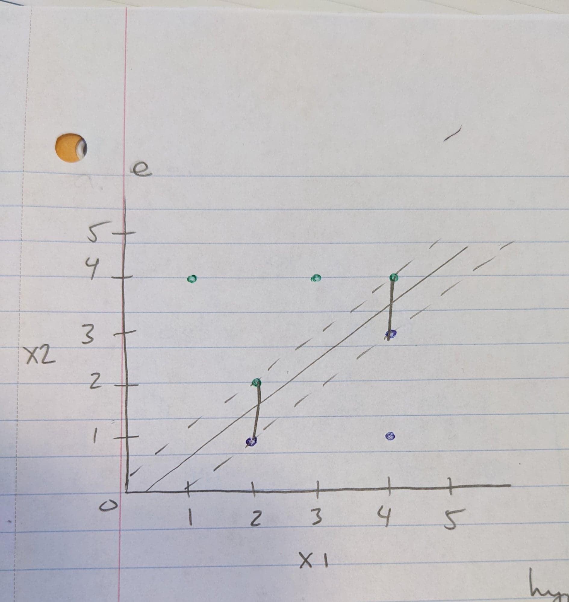

```{r setup, include=FALSE}
knitr::opts_chunk$set(echo = TRUE)
```

```{r}
pacman::p_load(e1071, ROCR, ISLR2, caTools)
```

9.3 Here we explore the maximal margin classifier on a toy data set.

a. We are given n = 7 observations in p = 2 dimensions. For each observation, there is an associated class label. Sketch the observations.
```{r}
plot(-1:5, -1:5, type="n", xlab= 'X1', ylab= 'X2')
points(c(3, 2, 4, 1), c(4, 2, 4, 2), col= "red", pch= 19)
points(c(2, 4, 4), c(1, 3, 1), col= "blue", pch= 19)
```

b. Sketch the optimal separating hyperplane, and provide the equation for this hyperplane (of the form (9.1)).

```{r}
plot(-1:5, -1:5, type="n", xlab= 'X1', ylab= 'X2')
points(c(3, 2, 4, 1), c(4, 2, 4, 2), col= "red", pch= 19)
points(c(2, 4, 4), c(1, 3, 1), col= "blue", pch= 19)
abline(-0.5, 1) #y intercept=-0.5 and gradient=1.
```


$$y = mx + c$$

And given X1, X2, m=1 and c=-0.5, we have:

$$ X_2-X_1 + 0.5 = 0$$

c. Describe the classification rule for the maximal margin classifier. It should be something along the lines of “Classify to Red if β0 + β1X1 + β2X2 > 0, and classify to Blue otherwise.” Provide the values for β0, β1, and β2.

Class Red if $X_2-X_1 + 0.5 > 0$ and Blue otherwise. $\beta_0=0.5 ; \beta_1=-1; \beta_2=1$ 

d. On your sketch, indicate the margin for the maximal margin hyperplane.
```{r}
plot(-1:5, -1:5, type="n", xlab= 'X1', ylab= 'X2')
points(c(3, 2, 4, 1), c(4, 2, 4, 2), col= "red", pch= 19)
points(c(2, 4, 4), c(1, 3, 1), col= "blue", pch= 19)
abline(-0.5, 1) #y intercept=-0.5 and gradient=1.
abline(-1, 1, lty= 'dotted')
abline(0, 1, lty= 'dotted')
```

e. Indicate the support vectors for the maximal margin classifier.
```{r}

```

f. Argue that a slight movement of the seventh observation would not affect the maximal margin hyperplane.

A slight movement of the seventh observation would not have an effect on the maximal margin hyperplane since it is located outside of the margin so a slight movement.4w

g. Sketch a hyperplane that is not the optimal separating hyperplane, and provide the equation for this hyperplane.
```{r}
plot(-1:5, -1:5, type="n", xlab= 'X1', ylab= 'X2')
points(c(3, 2, 4, 1), c(4, 2, 4, 2), col= "red", pch= 19)
points(c(2, 4, 4), c(1, 3, 1), col= "blue", pch= 19)
abline(-0.5, 1) #y intercept=-0.5 and gradient=1.
abline(0,0.8, col="green") #not optimal
abline(-1, 1, lty= 'dotted')
abline(0, 1, lty= 'dotted')
```

h. Draw an additional observation on the plot so that the two classes are no longer separable by a hyperplane. 
```{r}
plot(-1:5, -1:5, type="n", xlab= 'X1', ylab= 'X2')
points(c(3, 2, 4, 1), c(4, 2, 4, 2), col= "red", pch= 19)
points(c(2, 4, 4), c(1, 3, 1), col= "blue", pch= 19)
points(2, 3, col= "blue", pch= 17)
abline(-0.5, 1) #y intercept=-0.5 and gradient=1.
abline(-1, 1, lty= 'dotted')
abline(0, 1, lty= 'dotted')
```


9.5 
We have seen that we can fit an SVM with a non-linear kernel in order to perform classification using a non-linear decision boundary. We will now see that we can also obtain a non-linear decision boundary by performing logistic regression using non-linear transformations of the features.

a. Generate a data set with n = 500 and p = 2, such that the observations belong to two classes with a quadratic decision boundary between them. 
```{r}
set.seed(42)
x1 <- runif(500)-0.5
x2 <- runif(500)-0.5
y <- 1*(x1^2-x2^2 > 0)
df <- data.frame(x1= x1, x2= x2, y=as.factor(y))
head(df)
```

b. Plot the observations, colored according to their class labels. Your plot should display X1 on the x-axis, and X2 on the yaxis.
```{r}
plot(x1, x2, col= (2 - y))
```

c. Fit a logistic regression model to the data, using X1 and X2 as predictors.
```{r}
glm.fit <- glm(y~ x1+x2, data= df, family= 'binomial')
```

d. Apply this model to the training data in order to obtain a predicted class label for each training observation. Plot the observations, colored according to the predicted class labels. The decision boundary should be linear.
```{r}
glm.probs <- predict(glm.fit, newdata= df, type= 'response')
glm.preds <- rep(0, 500)
glm.preds[glm.probs>0.5] = 1

table(preds= glm.preds, truth= df$y)

plot(x1, x2, col= 2-glm.preds)
```

e. Now fit a logistic regression model to the data using non-linear functions of X1 and X2 as predictors (e.g. X2 1 , X1×X2, log(X2), and so forth). 
```{r}
glm.fit <- glm(y~I(x1^2)+I(x2^2), data = df, family = 'binomial')
```

f. Apply this model to the training data in order to obtain a predicted class label for each training observation. Plot the observations, colored according to the predicted class labels. The decision boundary should be obviously non-linear. If it is not, then repeat (a)-(e) until you come up with an example in which the predicted class labels are obviously non-linear.
```{r}
glm.probs <- predict(glm.fit, newdata= df, type= 'response')
glm.preds <- rep(0,500)
glm.preds[glm.probs>0.5] = 1

table(preds= glm.preds, truth=df$y)

plot(x1, x2, col=2-glm.preds)
```

g. Fit a support vector classifier to the data with X1 and X2 as predictors. Obtain a class prediction for each training observation. Plot the observations, colored according to the predicted class labels.
```{r}
tune.out <- tune(svm, y~., data=df, kernel='linear', ranges= list(cost=c(0.001, 0.01, 0.1, 1, 5, 10, 100)))
bestmod <- tune.out$best.model
```

```{r}
ypred <- predict(bestmod, newdata= df, type='response')
table(predict=ypred, truth=df$y)
plot(x1, x2, col=ypred)
```


h. Fit a SVM using a non-linear kernel to the data. Obtain a class prediction for each training observation. Plot the observations, colored according to the predicted class labels.
```{r}
tune.out <- tune(svm, y~., data=df, kernel='radial', ranges= list(cost=c(0.1, 1, 10, 100, 1000), gamma=c(0.5, 1, 2, 3, 4)))
bestmod <- tune.out$best.model
```

```{r}
ypred <- predict(bestmod, newdata=df, type='response')
table(predict= ypred, truth= df$y)
plot(x1, x2, col= ypred)
```


i. Comment on your results.

Logistic regression with non-linear terms and SVM with a radial kernel outperform the models using linear terms. The Logistic regression with non-linear terms and SVM with a radial kernel models achieve almost perfect accuracy in predicting the class of the training observations.

9.7
In this problem, you will use support vector approaches in order to predict whether a given car gets high or low gas mileage based on the Auto data set.

a. Create a binary variable that takes on a 1 for cars with gas mileage above the median, and a 0 for cars with gas mileage below the median.
```{r}
set.seed(42)
auto.length <- length(Auto$mpg)
mpg.median <- median(Auto$mpg)
mpg01 <- rep(NA, auto.length)

for(i in 1:auto.length) if (Auto$mpg[i] > mpg.median) mpg01[i]= 1 else mpg01[i]= 0

auto.df <- Auto
auto.df$mpg01 <- as.factor(mpg01)
```

b. Fit a support vector classifier to the data with various values of cost, in order to predict whether a car gets high or low gas mileage. Report the cross-validation errors associated with different values of this parameter. Comment on your results. Note you will need to fit the classifier without the gas mileage variable to produce sensible results.
```{r}
linear.tune <- tune(svm, mpg01~., data= auto.df, kernel= 'linear', ranges= list(cost=c(0.001, 0.01, 0.1, 1, 5, 10, 100, 1000)))
summary(linear.tune)
```
Training CV error decreases as cost increases with minimum at cost=1 then it begins to increase.


c. Now repeat (b), this time using SVMs with radial and polynomial basis kernels, with different values of gamma and degree and cost. Comment on your results. 
```{r}
set.seed(42)
radial.tune <- tune(svm, mpg01~., data= auto.df, kernel='radial', ranges= list(cost=c(0.1, 1, 10, 100, 1000), gamma=c(0.5, 1, 2, 3, 4)))

radial.tune$best.parameters
radial.tune$best.performance
```

Training CV is lowest for a radial model with cost=10 and gamma=0.5

```{r}
set.seed(42)
poly.tune <- tune(svm, mpg01~., data= auto.df, kernel='polynomial', ranges=list(cost=c(0.1, 1, 10, 100, 1000), degree=c(1, 2, 3, 4, 5)))

poly.tune$best.parameters
poly.tune$best.performance
```
The training error is minimized with cost= 1000 and degree= 1

d. Make some plots to back up your assertions in (b) and (c).
```{r}

```

9.8
This problem involves the OJ data set which is part of the ISLR2 package.
```{r}
data(OJ)
OJ <- OJ
```

(a) Create a training set containing a random sample of 800 observations, and a test set containing the remaining observations. 
```{r}
sample.data <- sample.split(OJ$Purchase, SplitRatio = 800/length(OJ$Purchase))
train.set <- subset(OJ, sample.data==T)
test.set <- subset(OJ, sample.data==F)
```

b. Fit a support vector classifier to the training data using cost = 0.01, with Purchase as the response and the other variables as predictors. Use the summary() function to produce summary statistics, and describe the results obtained. 
```{r}
svm.fit <- svm(Purchase~., data= train.set, kernel='linear', cost=0.01)
summary(svm.fit)
```
There are a large number of support vectors out of 800 observations, 216 belong to CH, 215 belong to MM.

c. What are the training and test error rates? 
```{r}
svm.pred <- predict(svm.fit, train.set)
er1 <- table(predict= svm.pred, truth= train.set$Purchase)
1 - sum(diag(er1)) / sum(er1)
```
```{r}
svm.pred <- predict(svm.fit, test.set)
er2 <- table(predict= svm.pred, truth= test.set$Purchase)
1 - sum(diag(er2)) / sum(er2)
```


d. Use the tune() function to select an optimal cost. Consider values in the range 0.01 to 10. 
```{r}
set.seed(42)
tune.out <- tune(svm, Purchase~., data=train.set, kernel= 'linear', range= list(cost=c(0.01, 0.1, 0.5, 1, 10)))
```


e. Compute the training and test error rates using this new value for cost. 
```{r}
svm.pred <- predict(tune.out$best.model, train.set)
er <- table(predict= svm.pred, truth= train.set$Purchase)

1 - sum(diag(er)) / sum(er)
```

```{r}
svm.pred <- predict(tune.out$best.model, test.set)
er <- table(predict= svm.pred, truth= test.set$Purchase)

1 - sum(diag(er)) / sum(er)
```

Using the optimal value of cost results in a slightly increased test error rate.

f. Repeat parts (b) through (e) using a support vector machine with a radial kernel. Use the default value for gamma. 
```{r}
set.seed(42)
tune.out <- tune(svm, Purchase~., data= train.set, kernel='radial', ranges=list(cost=c(0.01, 0.1, 0.5, 1, 10)))
```

```{r}
svm.pred <- predict(tune.out$best.model, train.set)
er <- table(predict= svm.pred, truth= train.set$Purchase)

1 - sum(diag(er)) / sum(er)
```

```{r}
svm.pred <- predict(tune.out$best.model, test.set)
er <- table(predict= svm.pred, truth= test.set$Purchase)

1 - sum(diag(er)) / sum(er)
```


g. Repeat parts (b) through (e) using a support vector machine with a polynomial kernel. Set degree = 2. 
```{r}
set.seed(42)
tune.out <- tune(svm, Purchase~., data= train.set, kernel= 'polynomial', ranges= list(cost=c(0.01, 0.1, 0.5, 1, 10)), degree=2)
```

```{r}
svm.pred <- predict(tune.out$best.model, train.set)
er <- table(predict= svm.pred, truth= train.set$Purchase)

1 - sum(diag(er)) / sum(er)
```

```{r}
svm.pred <- predict(tune.out$best.model, test.set)
er <- table(predict= svm.pred, truth= test.set$Purchase)

1 - sum(diag(er)) / sum(er)
```


h. Overall, which approach seems to give the best results on this data?

Overall the radial kernel seems to be producing minimum misclassification error on both training and test data.